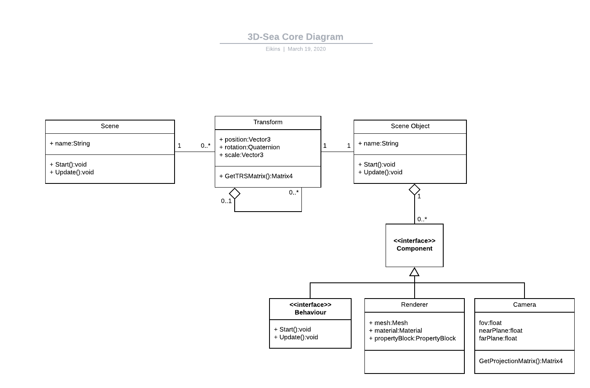

# 3D Sea Project

## Weekly Report - 20/03/2020

##### Table of Contents  
[Core](#Core)  
[Maths](#Maths)  
[OpenGL](#OpenGL)

### Core

The core architecture was defined.
The goal is to abstract OpenGL stuff.

 `Transform` are used for hierarchical modelling, each `Transform` can have a `parent` and `children`.  
 To each `Transform`, there is a corresponding `SceneObject` that a list of `Component`.
The idea is to give a flexible way to implement different behaviours for our objects such as *geomtric animation*, *material animations*, *user inputs*...

The `Camera` is a component, allowing us to control it with the same animation
algorithms as other objects.

### Maths

Instead of using the `transform.py` resource, we decided to re-implement our math
stuff for more flexibility in usage using **operator overloading**.
We then created the classes `Vector3` and `Quaternion`. The `Matrix4` class is just factory that generate numpy arrays accordingly.

##### Improvements
Some operators aren't implemented yet (*cross*, *dot*, *lerp**, *slerp*...).  
The `Camera` component is only able to simulate perspective cameras yet. 

##### Example of usage
```Python
        t0 = Transform(None) # t0 is a root Transform 
        t11 = Transform(t0) # Set t0 as parent of t11
        t12 = Transform(t0) # Set t0 as parent of t12

        t0.SetPosition(Vector3(1, 0, 0))
        t0.SetRotation(Quaternion.Euler(Vector3(90, 0, 0)))
        t11.SetPosition(Vector3(0, 1, 0))
        t12.SetPosition(Vector3(0, 0, 1))
```

```Python
        t0.SetRotation(t0._rotation * q)
        # Is equivalent to
        t0._rotation *= q
        t0.__changed = True # Mark transform for update
```

### OpenGL

No advancement yet.


