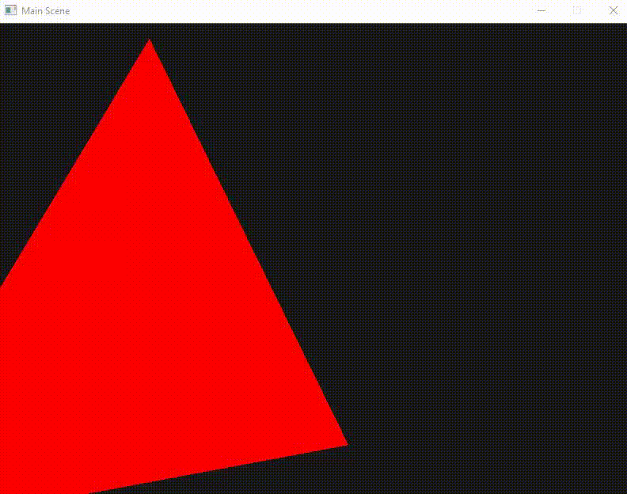

# 3D Sea Project

## Weekly Report - 27/03/2020

##### Table of Contents  
[Core](#Core)  
[Maths](#Maths)  
[OpenGL](#OpenGL)

### Core

Add the `Time` module to access time informations easily.
```Python
from sea3d.core import Time

# Time elapsed since the beginning of the scene
Time.time

# Time elapsed during the current frame and the last frame
Time.deltaTime
```

The `Mesh` class has been added.
All meshes have the same attributes : `vertices`, `normals` and `indexes`.  
This may change in the future.

### Maths

No improvements.

### OpenGL

The OpenGL implementation has begun.
For the moment, we have a `GLWindow`, `GLMaterial` and `GLVertexArray`.

The `GLWindow` ensure window creation and GL context initialization.
```Python
    window = GLWindow(width=800, height=600)
    window.Init()

    ...

    window.AttachScene(scene)
    window.SetRenderingCamera(camera)

    window.Run()
```

`GLMaterial` is a class that automatically compile the shaders and link the program.
```Python
baseMat = GLMaterial("BaseMaterial", "assets/shaders/base.vert", "assets/shaders/base.frag")
```
A material batch system will be added to optimize OpenGL program compilation and link reusing the shaders.

`GLVertexArray` is just an OpenGL adaptor for the `Mesh`.

The render loop has been implemented.
##### Example of usage
```Python
            ### Update callback
            ## Rotate around Y at 60° / second
            self.camera.object.transform._rotation *= Quaternion.AxisAngle(Vector3(0, 1, 0), 60 * Time.deltaTime)
            ## Mark transform for update, the loop will recompute the model matrix for the next frame
            self.camera.object.transform.MarkForUpdate() 
            ## Ping-pong translation along X
            # self.camera.object.transform.SetPosition(Vector3(0, 0, 1) + Vector3(1, 0, 0) * np.sin(Time.time * 2))

```
##### Result



