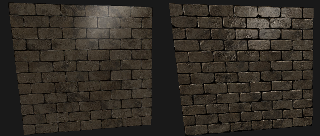

# 3D Sea Project

## Weekly Report - 03/04/2020

##### Table of Contents  
[Core](#Core)  
[Maths](#Maths)  
[OpenGL](#OpenGL)  
[Some Results](#Some-Results)

### Core

`Mesh` and `Texture` can now be loaded from a file using **assimp** bindings.

`Renderer` component has been added : it holds a `Mesh`, a `Material` and a `PropertyBlock`.

`PropertyBlock` is a data mapping containing all the shaders properties we want.  
It can be shared between renderers.

#### Creation of a Renderer
```Python
# Mesh.LoadFromFile returns a list of meshes
boxModel = Mesh.LoadFromFile("cube.obj")[0]

# Load the albedo and normal textures for the cube
boxTex = Texture.LoadFromFile("cube.png")
boxTexNormal = Texture.LoadFromFile("cube_normal.png")

# Create the component
boxRenderer = Renderer(boxModel, Material("Standard", "std_pbr", "std_pbr")

# Link properties
boxRenderer.properties.SetTexture("_AlbedoMap", boxTex)
boxRenderer.properties.SetTexture("_NormalMap", boxTexNormal)
boxRenderer.properties.SetFloat("_Shininess", 16.0)

# Add the component to the object
box.AddComponent(boxRenderer))
```
Properties are automatically linked to GPU programs.


#### Creation of a Behaviour
Behaviour components can be easily created to add behaviour to our objects.
```Python
class Rotator(Behaviour):

    def __init__(self, axis:Vector3, speed:float):
        super().__init__()
        self.axis = axis
        self.speed = speed

    # Update is called every frame, before rendering
    def Update(self):
        self.object.transform._rotation *= Quaternion.AxisAngle(self.axis, self.speed * Time.deltaTime)
        self.object.transform.MarkForUpdate()
```

Behaviour can also modify `Renderer` properties.
```Python
class ColorChange(Behaviour):

    def __init__(self):
        super().__init__()

    # Start is called upon initialization of the SceneObject
    def Start(self):
        # Get the renderer component.
        # Don't use GetComponent in Update, it is slower
        self.renderer:Renderer = self.object.GetComponent(Renderer)

    def Update(self):
        # Change Renderer _Color property
        color = Vector3(1.0, 0.2, 0.2) * (np.sin(Time.time) * 0.5 + 0.5))
        self.renderer.properties.SetVector3("_Color", color)

```


### Maths

The `Camera`'s projection matrix has been updated to use a **Left Handed Coordinate System (LHCS)**.  
This choice has been made to have a more intuitive usage. (LookAt, Move Forward...)

#### Bug Fixes
 - Fixed a bug with hierarchical model matrices computation. 

### OpenGL

OpenGL implementation has been refactored.
 - `GLVertexArray` became `GLStdVBO`
 - `GLMaterial` has been replaced with a `GLMaterialBatch`
   - The goal was to avoid duplication of programs.
 - `GLTextureAtlas` has been added
   - Responsible for texture initialization
 - `GLWindow` has been updated accordingly


To match our **LHCS** choice, some changes has been made :
 - Depth range has been changed from [0, 1] to [1, 0]
 - Depth test function is set to `GL_LESS`

Shaders can now be linked with properties, and can have default values !
For instance, here is an example used with the `ColorChange` component example.
```GLSL
#version 330 core

uniform vec3 _Color = vec3(0.0, 0.0, 0.0);
uniform float _Atten = 1.0;

out vec4 FragColor;

void main() {
    FragColor = vec4(_Color * _Atten, 0.2);
}
```

We currently are working on a `GLRenderingQueue` to allow transparency good usage.

### Some Results

#### Normal Mapping
Brickwall without / with normal mapping.


#### Basic scene


Scene breakdown:
-  Box (Renderer, Rotator)
   -  Bunny (Renderer)
-  Fish (Renderer)
-  Water Plane (Renderer) *Generated*

Scene code :
```Python
    scene = Scene("Main Scene")

    camera = Camera(aspect=1600/900, far=1000)
    cameraObject = SceneObject("Camera 1")
    cameraObject.AddComponent(camera)

    # Meshes
    plane = GeneratePlane((5, 5), (10, 10), repeat_uv=True)
    bunnyModel = Mesh.LoadFromFile("bunny.obj")[0]
    boxModel = Mesh.LoadFromFile("cube.obj")[0]
    fishModel = Mesh.LoadFromFile("TropicalFish01.obj")[0]

    plane.vertices[:, 1] += np.random.normal(size=(len(plane.vertices))) / 40

    # Textures
    bunnyTex = Texture.LoadFromFile("bunny.png")
    bunnyTexNormal = Texture.LoadFromFile("bunny_normal.png")
    boxTex = Texture.LoadFromFile("cube.png")
    boxTexNormal = Texture.LoadFromFile("normal.png")
    fishTex = Texture.LoadFromFile("TropicalFish01.jpg")
    fishTexNormal = Texture.LoadFromFile("TropicalFish01_NormalMap.jpg")

    # Objects
    waterPlane = SceneObject("Water")
    waterPlane.transform.SetPosition(Vector3(0, -1, 0))
    waterPlane.AddComponent(Renderer(plane, Material("WaterMaterial", "std_pbr", "color")))
    waterPlane.GetComponent(Renderer).properties.SetVector3("_Color", Vector3(0.43, 0.73, 1.0))

    box = SceneObject("Box")
    box.transform.SetPosition(Vector3(-1, -1, -1))
    box.transform.SetRotation(Quaternion.Eulerf(5, 0, -5))
    box.transform.SetScale(Vector3(1, 1, 1) * 0.5)
    box.AddComponent(Renderer(boxModel, Material("Standard", "std_pbr", "std_pbr")))
    box.GetComponent(Renderer).properties.SetTexture("_AlbedoMap", boxTex)
    box.GetComponent(Renderer).properties.SetTexture("_NormalMap", boxTexNormal)
    box.GetComponent(Renderer).properties.SetFloat("_Shininess", 16.0)
    box.AddComponent(Rotator(Vector3(0, 1, 0), 30))

    bunny = SceneObject("Bunny", box.transform)
    bunny.transform.SetPosition(Vector3(0, 1, 0))
    bunny.transform.SetRotation(Quaternion.Eulerf(0, 180, 0))
    bunny.AddComponent(Renderer(bunnyModel, Material("Standard", "std_pbr", "std_pbr")))
    bunny.GetComponent(Renderer).properties.SetTexture("_AlbedoMap", bunnyTex)
    bunny.GetComponent(Renderer).properties.SetTexture("_NormalMap", bunnyTexNormal)
    bunny.GetComponent(Renderer).properties.SetFloat("_Shininess", 1.0)
    bunny.GetComponent(Renderer).properties.SetFloat("_Emission", 0.3)
    bunny.GetComponent(Renderer).properties.SetFloat("_Diffusion", 0.4)

    fish = SceneObject("Fish")
    fish.transform.SetPosition(Vector3(3, -3, 3))
    fish.transform.SetRotation(Quaternion.Eulerf(0, 75, 0))
    fish.transform.SetScale(Vector3(1, 1, 1) * 0.002)
    fish.AddComponent(Renderer(fishModel, Material("Standard", "std_pbr", "std_pbr")))
    fish.GetComponent(Renderer).properties.SetTexture("_AlbedoMap", fishTex)
    fish.GetComponent(Renderer).properties.SetTexture("_NormalMap", fishTexNormal)
    fish.GetComponent(Renderer).properties.SetFloat("_Shininess", 16.0)

    # Add to scene
    scene.AddObject(bunny)
    scene.AddObject(fish)
    scene.AddObject(box)
    scene.AddObject(waterPlane)
```